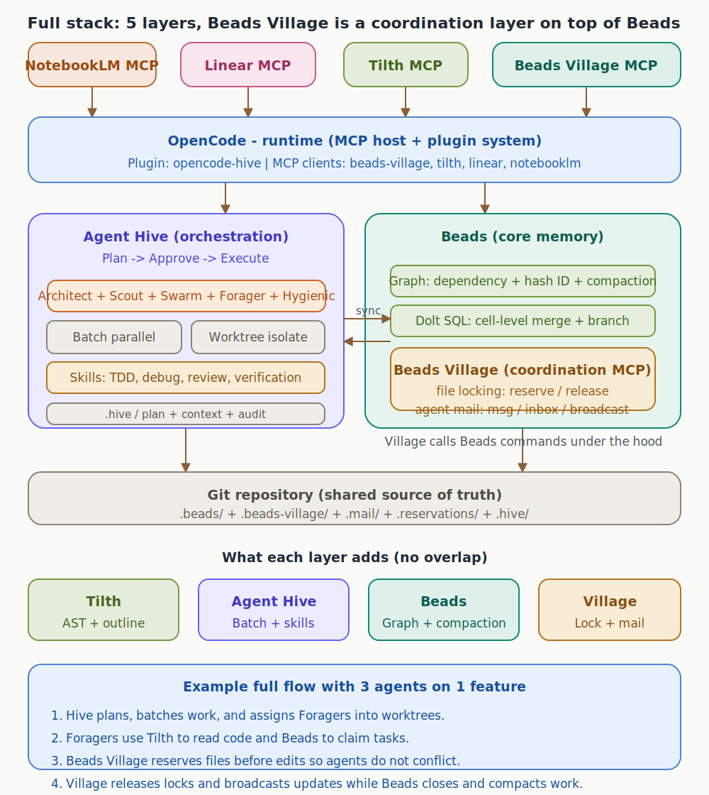
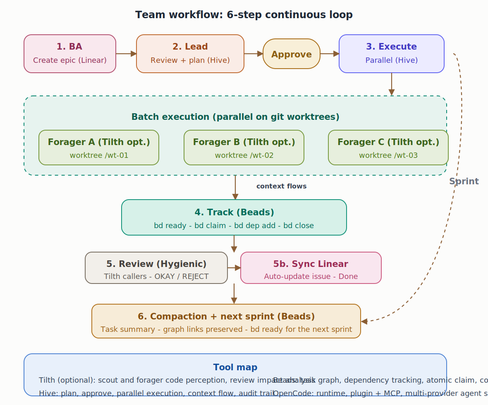

# Foundation Kit


A public starter for teams that want a shared AI development stack with
OpenCode-native runtime wiring and docs/processes that remain usable from Claude
Code as well.

This starter treats the following as one coherent stack:
- `OpenCode` as runtime and MCP host
- `Agent Hive` as orchestration and plan-first execution flow
- `Beads` as the core task graph and execution memory layer
- `Beads Village` as the coordination layer on top of Beads
- `Tilth` as the code-perception layer
- `Linear` and `NotebookLM` as native MCP integrations for planning and retrieval

## Core Principle

In this starter, the stack is native to `OpenCode`.

- root `opencode.json` is the canonical stack config
- `opencode-hive` runs as the orchestration plugin
- `beads-village`, `tilth`, `linear`, and `notebooklm` run as MCP servers
- `Beads Village` does not replace Beads core; it wraps it with locking and
  messaging
- no layer is meant to overlap another layer's responsibility

## What This Starter Gives You

- a root `opencode.json` with the native stack wired in
- documented standards for OpenCode, Hive, Beads, Beads Village, and Tilth
- pod templates and Hive templates for in-repo handoff
- reference configs under `examples/opencode/`
- workflow diagrams for architecture and execution

## Why These Layers Exist

Each layer solves a different failure mode in AI-assisted development. The goal
is not to add tools for the sake of it, but to avoid making one tool carry too
many responsibilities.

### Why Agent Hive

Use `Agent Hive` because orchestration is a separate problem from execution.

- it gives the team a plan -> approve -> execute model
- it batches independent work and isolates it in worktrees
- it provides handoff structure, review gates, and audit trail in `.hive/`
- it keeps multi-step work coordinated instead of turning every session into ad
  hoc prompting

Without Hive, OpenCode can still run agents, but the team loses a strong
orchestration layer for non-trivial work.

### Why Beads

Use `Beads` because durable execution memory is a separate problem from
orchestration.

- it owns the engineering task graph
- it tracks dependencies, claims, blockers, and closure over time
- it gives the team compaction and persistent execution memory between sessions
- it keeps engineering state out of chat history and scattered notes

Without Beads, the team has plans but lacks a durable graph of actual execution.

### Why Beads Village

Use `Beads Village` because coordination between multiple agents is a separate
problem from the Beads graph itself.

- it wraps Beads core with file locking and agent messaging
- it prevents two builders from editing the same file blindly
- it gives agents a lightweight coordination channel during parallel work
- it adds workspace visibility without replacing Beads core

Beads Village does not replace Beads. It adds the lock + mail layer that Beads
core does not provide on its own.

### Why Tilth

Use `Tilth` because code perception is a separate problem from orchestration,
memory, and coordination.

- it improves structural file reading for large codebases
- it gives definition-first search instead of plain string matching
- it exposes callers, callees, and impact analysis faster
- it reduces wasted tool loops during implementation and review

Without Tilth, the stack still works, but agents spend more effort navigating
code and understanding impact.

## Install And Setup

### 1. Install OpenCode

```bash
curl -fsSL https://opencode.ai/install | bash
```

### 2. Install Beads

```bash
curl -fsSL https://raw.githubusercontent.com/steveyegge/beads/main/scripts/install.sh | bash
```

Or use the helper in this repo:

```bash
bash scripts/setup-beads.sh
```

### 3. Install Tilth

```bash
bash scripts/setup-tilth.sh
```

### 4. Verify the native MCP stack pieces

```bash
npx beads-village --help
```

```bash
tilth --help
```

Or run the built-in preflight:

```bash
bash scripts/check-native-stack.sh
```

### 5. Launch OpenCode

```bash
opencode
```

### 6. Complete local auth for external MCP integrations

- authenticate `Linear` MCP in your local OpenCode environment
- authenticate `NotebookLM` MCP in your local OpenCode environment

## Native OpenCode Configuration

The root `opencode.json` is the starter's source of truth for runtime wiring.

It configures:
- plugin: `opencode-hive`
- MCP servers: `beads-village`, `tilth`, `linear`, `notebooklm`

That means OpenCode is the place where the stack is assembled, while each tool
still keeps its own responsibility.

## Doctor

Use these exact commands to validate the stack locally.

### Basic CLI checks

```bash
opencode --help
bd --help
tilth --help
npx beads-village --help
```

### Project preflight

```bash
bash scripts/check-native-stack.sh
```

Expected:
- native stack preflight passes
- only auth reminders may remain for `Linear` and `NotebookLM`

### OpenCode runtime check

```bash
opencode mcp list
```

Expected configured servers:
- `beads-village`
- `tilth`
- `linear`
- `notebooklm`

## Architecture



## Team Workflow



### 1. BA or PM creates the work

- requirements live in `Linear` or the planning system your team uses
- business priority stays outside Beads core

### 2. Lead reviews and plans

- leads review context from docs, design, and retrieval sources
- `Hive` creates or coordinates the approved execution flow

### 3. Builders execute in parallel

- builders claim work in `Beads`
- `Hive` batches tasks and isolates execution through worktrees
- `Tilth` handles code perception during implementation and review

### 4. Beads Village coordinates the builders

- use `reserve` and `release` to avoid file conflicts
- use `msg` and `inbox` to coordinate between agents and batches
- use Beads Village status and dashboards for visibility when helpful

### 5. Review and sync

- review outcomes feed back into docs, pods, and delivery systems
- external issue sync happens after review passes

### 6. Compact and carry forward

- Beads keeps execution memory over time
- Beads Village coordination state supports active work
- durable outcomes are promoted into `docs/` and `pods/`

## Tool Map

- `OpenCode` - runtime, providers, plugin host, MCP host
- `Hive` - planning, approval, batching, worktree execution, skills
- `Beads` - task graph, dependency memory, claim/close flow, compaction
- `Beads Village` - locking, messaging, status, dashboard
- `Tilth` - AST-aware search, definition tracing, callers/callees, edit anchors
- `Linear` - planning and issue state
- `NotebookLM` - retrieval for BRD, architecture, and decision context
- `Figma` - approved design intent

## Repository Layout

- `opencode.json` - native OpenCode runtime config for the stack
- `docs/` - durable standards and operating guidance
- `docs/diagrams/` - architecture and workflow diagrams
- `docs/opencode-agents/` - standardized OpenCode role specs
- `examples/opencode/` - commented reference configs aligned with the same stack
- `.hive/` - Hive planning templates and handoff scaffolding
- `pods/` - default pod-local context, dependencies, decisions, and task memory
- `scripts/` - setup helpers for Beads and Tilth
- `scripts/check-native-stack.sh` - preflight checker for the native stack

## Included Standards

- `docs/opencode-standard.md`
- `docs/beads-standard.md`
- `docs/beads-village-integration.md`
- `docs/tilth-integration.md`
- `docs/team-stack-pattern.md`
- `docs/agent-hive-standard.md`
- `docs/integration-model.md`
- `docs/code-standards.md`
- `docs/codebase-summary.md`

## Included Templates

- `.hive/templates/plan.md`
- `.hive/templates/task-spec.md`
- `.hive/templates/task-report.md`
- `pods/candidate-experience/tasks/_template.md`
- `pods/content-cms-strapi/tasks/_template.md`

## Reference Configs

- `opencode.json` - canonical native stack config
- `examples/opencode/opencode.foundation.jsonc` - native stack plus explicit
  agent shaping
- `examples/opencode/opencode.team-stack.jsonc` - native stack with commented
  reference wiring for the full team model

## Public Starter Rules

- do not treat `Beads Village` as a replacement for `Beads`
- do not treat `Tilth` as memory or orchestration
- do not move durable knowledge into messages or reservations
- do not let OpenCode become the source of truth instead of docs, pods, and the
  planning systems
- keep each layer responsible for one thing:
  runtime, orchestration, memory, coordination, or perception

## After Clone

1. keep or rename the default pods in `pods/`
2. initialize and adopt `Beads` as the execution layer
3. confirm `beads-village` and `tilth` resolve on your machine
4. authenticate `Linear` and `NotebookLM` MCP integrations locally
5. use the root `opencode.json` as the native project config
6. replace starter wording in docs with your project-specific sources of truth
